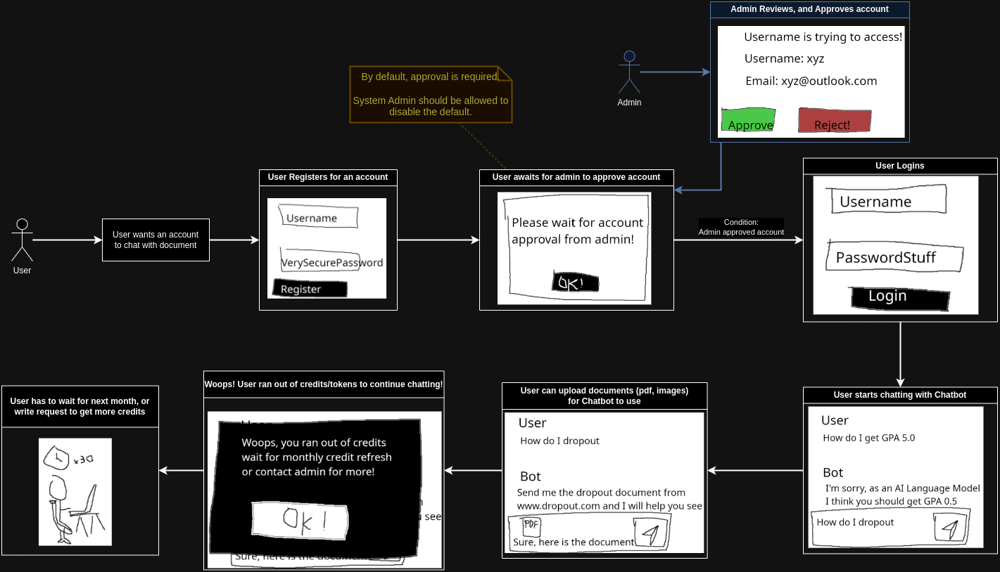

Muimi Chat is an open-source project created for a university coursework assignment.

Muimi Chat allows users to engage in conversations with their favorite LLM (Language Learning Models).

# User Story

**New User Registration Process:**

1. A new user should register an account and request account approval.
2. The admin will review and approve the account.
3. Once approved, the user can log in and start chatting with the chatbot.

**Usage Limit:**

- Each user has a token usage limit.
- Upon reaching the limit, further chatting is disallowed.
- Tokens should be refreshed monthly or updated by the admin.
